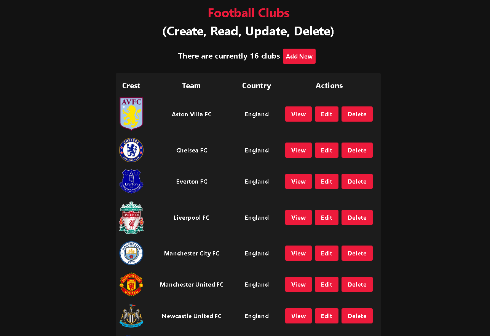

[](https://github.com/Horacaz/crud-clubs-front/actions/workflows/pipeline.yml)

# Crud Clubs

A simple Crud (Create, Read, Update, Delete) of Football Clubs. This App consumes the API that is currently hosted on Render `https://crub-clubs-api.onrender.com/api`. Due to the free hosting plan the API may not be available at first, after a period of inactivity any request sent to it will re-start the server and the API will function as intended. The backend of this App, serving the mentioned API, is available on the following repository [crud-clubs-back](https://github.com/Horacaz/crud-clubs-back).

## Getting started with this repository

After downloading or cloning this repository with `git clone https://github.com/Horacaz/crud-clubs-front`, it is necessary to install its dependencies by running `npm install`.

After installing the dependecies running `npm run dev` in your terminal will start a development build bundled by Vite that will be available by default on an open localhost port.

### Preview of the scripts.

```
{
  "dev": "vite",
  "build": "tsc && vite build",
  "lint": "eslint . --ext ts,tsx --report-unused-disable-directives --max-warnings 0",
  "preview": "vite preview",
  "prepare": "husky install",
  "test:watch": "jest --watch",
  "test": "jest",
  "style": "prettier src --write",
  "cypress:run": "cypress run"
}
```

## Tech Stack

This project is built with Typescript on top of React, using the latest build provided by Vite. It is also unit-tested with Jest and React Testing Library. Husky is also implemented to lint every staged file with Eslint and Prettier before every commit to ensure a consistent code style, and that each test passes before any committing any changes to the master branch. For styling, this App uses Tailwindcss. This repository also possesses a GitHubActions workflow to ensure any pull request and pushes to the master branch are updated and the changes made pass both the Unit Tests and E2E Tests.

## App Preview


